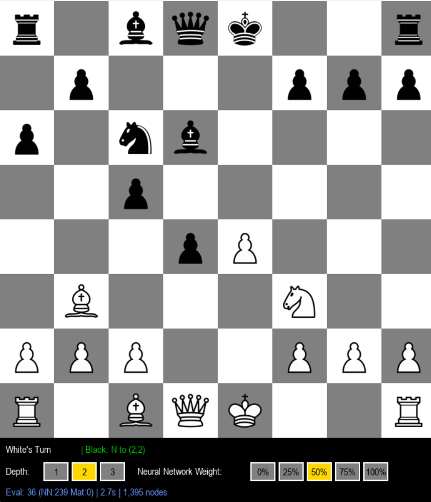

# Chess-AI

Uses PyTorch to train and run a CNN Model. Trained via lichess.org database: https://database.lichess.org/#evals



## Instructions to Play Against Pre-downloaded Model: 

1. Download the latest release of Python
2. Run the following commands in a terminal:
   ```
      pip install pygame
      pip install torch torchvision torchaudio
   ```
4. Download and extract the GitHub files
5. Navigate to the extracted folder and run
   ```py main.py```
6. Enjoy!


## Instructions to Train Model:

1. Download the lichess.org database (https://database.lichess.org/#evals) and fully extract
2. Download and extract the GitHub files, remove the existing chess_model.pth from the folder.
3. Paste the extracted lichess.org database into the extract GitHub folder.
4. In the same directory, run
    ```
       py process_data.py
       py neural_network_trainer.py
    ```
5. You can now use the newly trained model to play against! If you to change the amount of training data used, you can change MAX_INPUT_LINES and TOTAL_OUTPUT_POSITIONS in process_data.py to extract more data and change TRAINING_LINE_LIMIT in neural_network_trainer.py to utilize more data. For a strong model, use the full data and train for several hours.

